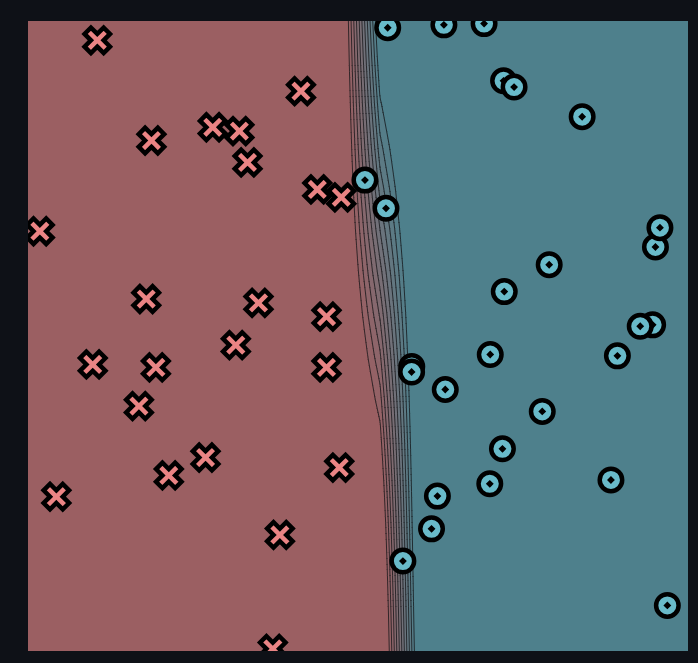
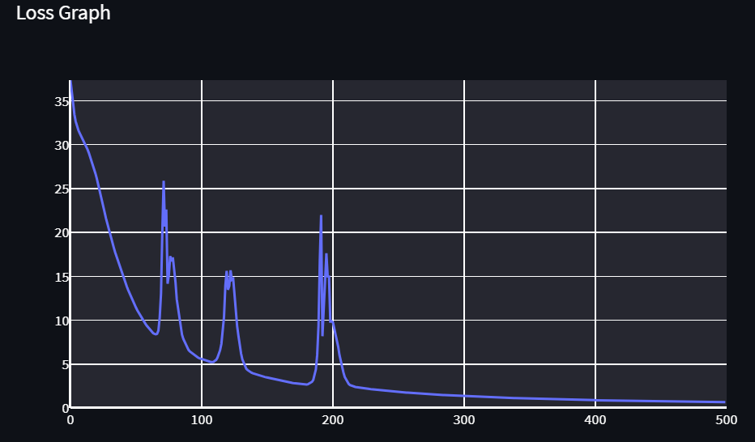
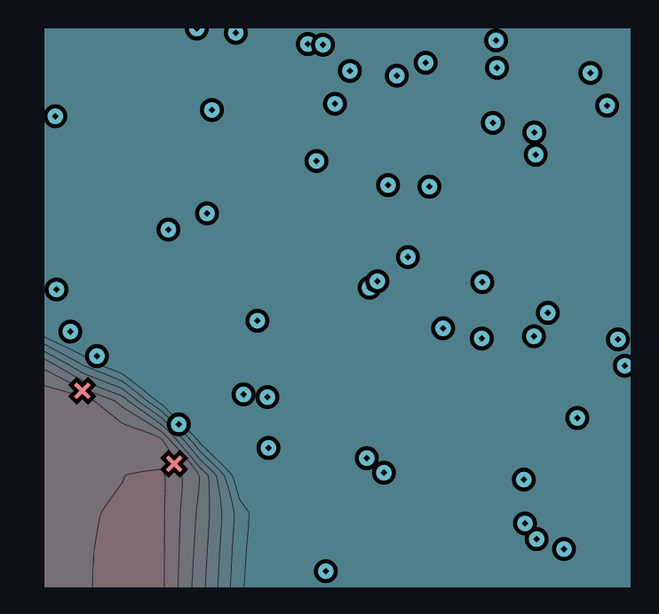
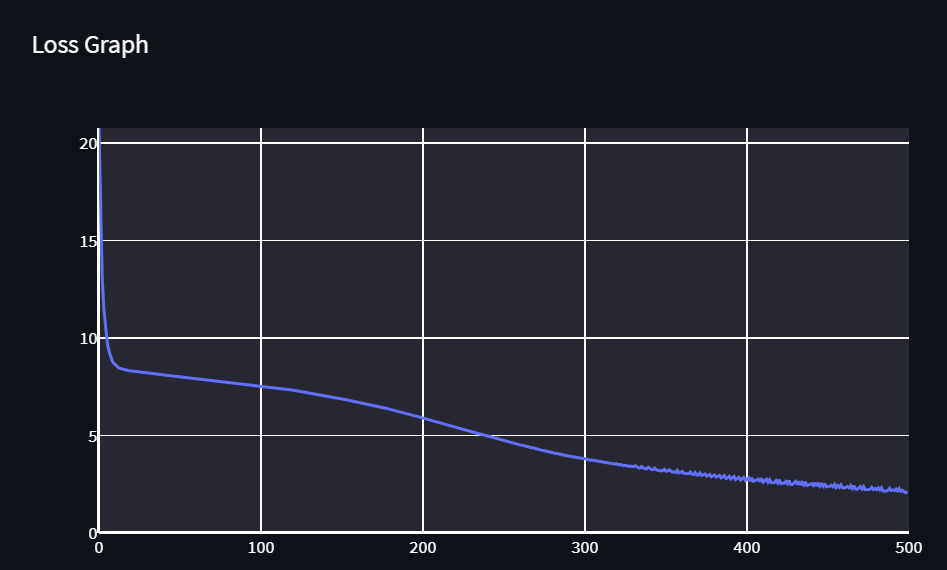
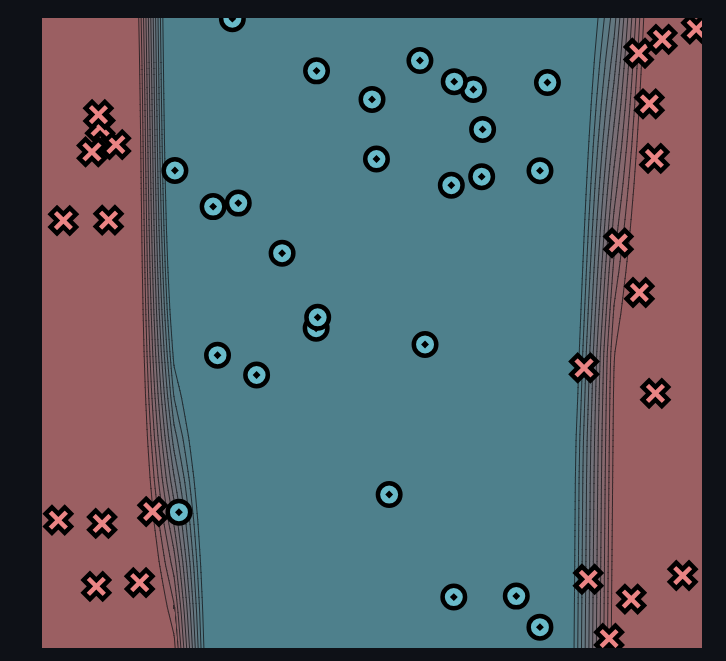
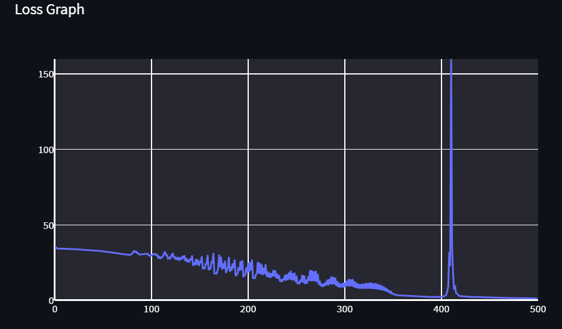
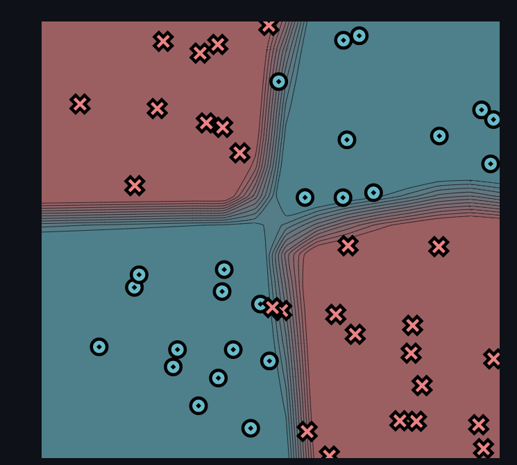
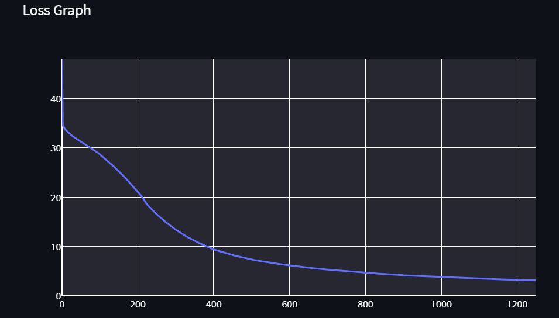

[](https://classroom.github.com/a/YFgwt0yY)
# MiniTorch Module 2


* Docs: https://minitorch.github.io/

* Overview: https://minitorch.github.io/module2/module2/

This assignment requires the following files from the previous assignments. You can get these by running

```bash
python sync_previous_module.py previous-module-dir current-module-dir
```

The files that will be synced are:

        minitorch/operators.py minitorch/module.py minitorch/autodiff.py minitorch/scalar.py minitorch/scalar_functions.py minitorch/module.py project/run_manual.py project/run_scalar.py project/datasets.py


## Output of trained model
### Simple
Time per epoch: 0.098s

Used the following parameters:
* PTS = 50
* DATASET = SIMPLE
* HIDDEN = 2
* RATE = 0.5
* EPOCHS = 500

#### Simple Training Log
```
Epoch: 0/500, loss: 0, correct: 0
Epoch: 10/500, loss: 30.745744187115402, correct: 34
Epoch: 20/500, loss: 26.714661539187404, correct: 38
Epoch: 30/500, loss: 20.3958815169716, correct: 44
Epoch: 40/500, loss: 15.47338748669406, correct: 44
Epoch: 50/500, loss: 11.7072518055109, correct: 49
Epoch: 60/500, loss: 9.191162195138038, correct: 50
Epoch: 70/500, loss: 13.039911417972514, correct: 44
Epoch: 80/500, loss: 15.055233087446926, correct: 43
Epoch: 90/500, loss: 6.7922496734815905, correct: 49
Epoch: 100/500, loss: 5.624612883934182, correct: 49
Epoch: 110/500, loss: 5.238900268528277, correct: 49
Epoch: 120/500, loss: 15.620808042214627, correct: 43
Epoch: 130/500, loss: 7.0074848100752725, correct: 47
Epoch: 140/500, loss: 3.9514472562185206, correct: 50
Epoch: 150/500, loss: 3.500183237773956, correct: 50
Epoch: 160/500, loss: 3.14855544186811, correct: 50
Epoch: 170/500, loss: 2.855335870827056, correct: 50
Epoch: 180/500, loss: 2.6595272310825058, correct: 50
Epoch: 190/500, loss: 9.338979378883979, correct: 46
Epoch: 200/500, loss: 9.874146632945989, correct: 46
Epoch: 210/500, loss: 3.5327338846946206, correct: 49
Epoch: 220/500, loss: 2.3491392257726087, correct: 50
Epoch: 230/500, loss: 2.1416150646950665, correct: 50
Epoch: 240/500, loss: 1.9770962716283829, correct: 50
Epoch: 250/500, loss: 1.8429917788963834, correct: 50
Epoch: 260/500, loss: 1.7250760166230574, correct: 50
Epoch: 270/500, loss: 1.6099720803791229, correct: 50
Epoch: 280/500, loss: 1.516297643719326, correct: 50
Epoch: 290/500, loss: 1.43306468004857, correct: 50
Epoch: 300/500, loss: 1.3584285865686252, correct: 50
Epoch: 310/500, loss: 1.2911332190535216, correct: 50
Epoch: 320/500, loss: 1.2301616175445924, correct: 50
Epoch: 330/500, loss: 1.1746755349665146, correct: 50
Epoch: 340/500, loss: 1.1239763247236405, correct: 50
Epoch: 350/500, loss: 1.0774767092955706, correct: 50
Epoch: 360/500, loss: 1.0346795623866674, correct: 50
Epoch: 370/500, loss: 0.9951615156223141, correct: 50
Epoch: 380/500, loss: 0.9585600480013916, correct: 50
Epoch: 390/500, loss: 0.9245631796628996, correct: 50
Epoch: 400/500, loss: 0.892901161794365, correct: 50
Epoch: 410/500, loss: 0.8708343416674215, correct: 50
Epoch: 420/500, loss: 0.8515096274230338, correct: 50
Epoch: 430/500, loss: 0.8259050895017961, correct: 50
Epoch: 440/500, loss: 0.8012585181284977, correct: 50
Epoch: 450/500, loss: 0.786100531427258, correct: 50
Epoch: 460/500, loss: 0.7673300236753323, correct: 50
Epoch: 470/500, loss: 0.7460948667978814, correct: 50
Epoch: 480/500, loss: 0.7166759736272147, correct: 50
Epoch: 490/500, loss: 0.6920809507613113, correct: 50
Epoch: 500/500, loss: 0.6754303653458914, correct: 50
```




### DIAG
Time per epoch: 0.133s

Used the following parameters:
* PTS = 50
* DATASET = DIAG
* HIDDEN = 3
* RATE = 0.5
* EPOCHS = 500

#### DIAG Training Log
```
Epoch: 0/500, loss: 0, correct: 0
Epoch: 10/500, loss: 8.71439001268341, correct: 48
Epoch: 20/500, loss: 8.320789749907425, correct: 48
Epoch: 30/500, loss: 8.212509356487896, correct: 48
Epoch: 40/500, loss: 8.11914129050124, correct: 48
Epoch: 50/500, loss: 8.0300081959525, correct: 48
Epoch: 60/500, loss: 7.942310523685263, correct: 48
Epoch: 70/500, loss: 7.853145703176516, correct: 48
Epoch: 80/500, loss: 7.761352879295771, correct: 48
Epoch: 90/500, loss: 7.6654658204872055, correct: 48
Epoch: 100/500, loss: 7.562877458659861, correct: 48
Epoch: 110/500, loss: 7.453607647001386, correct: 48
Epoch: 120/500, loss: 7.334321710260998, correct: 48
Epoch: 130/500, loss: 7.199168580571607, correct: 48
Epoch: 140/500, loss: 7.045568034089806, correct: 48
Epoch: 150/500, loss: 6.8869761104997655, correct: 48
Epoch: 160/500, loss: 6.728148929884745, correct: 48
Epoch: 170/500, loss: 6.553536171257911, correct: 48
Epoch: 180/500, loss: 6.362842937193769, correct: 48
Epoch: 190/500, loss: 6.15207490280932, correct: 48
Epoch: 200/500, loss: 5.918682374343869, correct: 48
Epoch: 210/500, loss: 5.6659464805312325, correct: 48
Epoch: 220/500, loss: 5.429600715843431, correct: 48
Epoch: 230/500, loss: 5.2113328972954465, correct: 48
Epoch: 240/500, loss: 4.9932772349909325, correct: 48
Epoch: 250/500, loss: 4.773497653349825, correct: 48
Epoch: 260/500, loss: 4.540310682855701, correct: 48
Epoch: 270/500, loss: 4.3376212711263715, correct: 48
Epoch: 280/500, loss: 4.125247346752313, correct: 48
Epoch: 290/500, loss: 3.9573228221809047, correct: 48
Epoch: 300/500, loss: 3.805294549918732, correct: 48
Epoch: 310/500, loss: 3.6623503522456033, correct: 48
Epoch: 320/500, loss: 3.548053723036415, correct: 48
Epoch: 330/500, loss: 3.392729068805575, correct: 48
Epoch: 340/500, loss: 3.3703302291568877, correct: 48
Epoch: 350/500, loss: 3.2641194518316183, correct: 48
Epoch: 360/500, loss: 3.1032648771404707, correct: 48
Epoch: 370/500, loss: 2.9788311769482245, correct: 48
Epoch: 380/500, loss: 2.9218314303739827, correct: 48
Epoch: 390/500, loss: 2.907929285332404, correct: 48
Epoch: 400/500, loss: 2.691782608032066, correct: 48
Epoch: 410/500, loss: 2.808912951398827, correct: 48
Epoch: 420/500, loss: 2.566383725471458, correct: 48
Epoch: 430/500, loss: 2.538023955201902, correct: 48
Epoch: 440/500, loss: 2.4636808054288273, correct: 48
Epoch: 450/500, loss: 2.3661787696888137, correct: 49
Epoch: 460/500, loss: 2.3160345076267435, correct: 49
Epoch: 470/500, loss: 2.2969622525051663, correct: 49
Epoch: 480/500, loss: 2.2855751010439893, correct: 48
Epoch: 490/500, loss: 2.1837002867895294, correct: 50
Epoch: 500/500, loss: 2.1277506404693116, correct: 50
```




### SPLIT
Time per epoch: 0.267s

Used the following parameters:
* PTS = 50
* DATASET = SPLIT
* HIDDEN = 5
* RATE = 0.5
* EPOCHS = 500

#### SPLIT Training Log
```
Epoch: 0/500, loss: 0, correct: 0
Epoch: 10/500, loss: 34.21839019509963, correct: 26
Epoch: 20/500, loss: 33.96424720669885, correct: 31
Epoch: 30/500, loss: 33.63223678394819, correct: 32
Epoch: 40/500, loss: 33.18669965916978, correct: 31
Epoch: 50/500, loss: 32.590518003601126, correct: 32
Epoch: 60/500, loss: 31.805649913515374, correct: 32
Epoch: 70/500, loss: 30.736316748249294, correct: 35
Epoch: 80/500, loss: 30.551625756844256, correct: 33
Epoch: 90/500, loss: 30.437215882576755, correct: 33
Epoch: 100/500, loss: 29.363881293336078, correct: 33
Epoch: 110/500, loss: 27.902788725843106, correct: 33
Epoch: 120/500, loss: 27.60053630963551, correct: 33
Epoch: 130/500, loss: 26.448799350654443, correct: 35
Epoch: 140/500, loss: 25.159539342219293, correct: 36
Epoch: 150/500, loss: 22.79005687064549, correct: 38
Epoch: 160/500, loss: 20.066489968801392, correct: 41
Epoch: 170/500, loss: 21.826254980679032, correct: 35
Epoch: 180/500, loss: 21.626563430955756, correct: 35
Epoch: 190/500, loss: 17.806764614670577, correct: 40
Epoch: 200/500, loss: 18.393935258586918, correct: 39
Epoch: 210/500, loss: 18.00689522304517, correct: 39
Epoch: 220/500, loss: 15.84914591767905, correct: 42
Epoch: 230/500, loss: 14.682178925697622, correct: 43
Epoch: 240/500, loss: 13.048164354881523, correct: 44
Epoch: 250/500, loss: 12.278345665983027, correct: 45
Epoch: 260/500, loss: 10.870395055485277, correct: 46
Epoch: 270/500, loss: 12.603284755141297, correct: 45
Epoch: 280/500, loss: 9.389511954793385, correct: 45
Epoch: 290/500, loss: 10.665903454049356, correct: 45
Epoch: 300/500, loss: 8.527086538632222, correct: 48
Epoch: 310/500, loss: 8.822452938652281, correct: 47
Epoch: 320/500, loss: 7.661609165182324, correct: 48
Epoch: 330/500, loss: 7.613153591619207, correct: 48
Epoch: 340/500, loss: 6.689462575048152, correct: 48
Epoch: 350/500, loss: 4.379526440384852, correct: 49
Epoch: 360/500, loss: 2.9858236361261428, correct: 50
Epoch: 370/500, loss: 2.603853987048525, correct: 50
Epoch: 380/500, loss: 2.380974232468393, correct: 50
Epoch: 390/500, loss: 2.229939697005624, correct: 50
Epoch: 400/500, loss: 2.3102699174165844, correct: 50
Epoch: 410/500, loss: 22.665075178726006, correct: 39
Epoch: 420/500, loss: 2.87352279611792, correct: 50
Epoch: 430/500, loss: 2.355553694950483, correct: 50
Epoch: 440/500, loss: 2.0917809357304282, correct: 50
Epoch: 450/500, loss: 1.885919070417525, correct: 50
Epoch: 460/500, loss: 1.7199177051470904, correct: 50
Epoch: 470/500, loss: 1.5810581364887304, correct: 50
Epoch: 480/500, loss: 1.464634964727603, correct: 50
Epoch: 490/500, loss: 1.3616031230764782, correct: 50
Epoch: 500/500, loss: 1.2696918507023989, correct: 50
```




### XOR
Time per epoch: 0.722s

Used the following parameters:
* PTS = 50
* DATASET = XOR
* HIDDEN = 10
* RATE = 0.5
* EPOCHS = 500

#### XOR Training Log
```

```





### Circle
Time per epoch:

Used the following parameters:
* PTS = 50
* DATASET = XOR
* HIDDEN = 12
* RATE = 0.5
* EPOCHS = 500

#### Circle Training Log
```

time per epoch:


```


### Spiral
Time per epoch:

Used the following parameters:
* PTS = 50
* DATASET = XOR
* HIDDEN = 14
* RATE = 0.5
* EPOCHS = 500

#### Spiral Training Log
```

```


